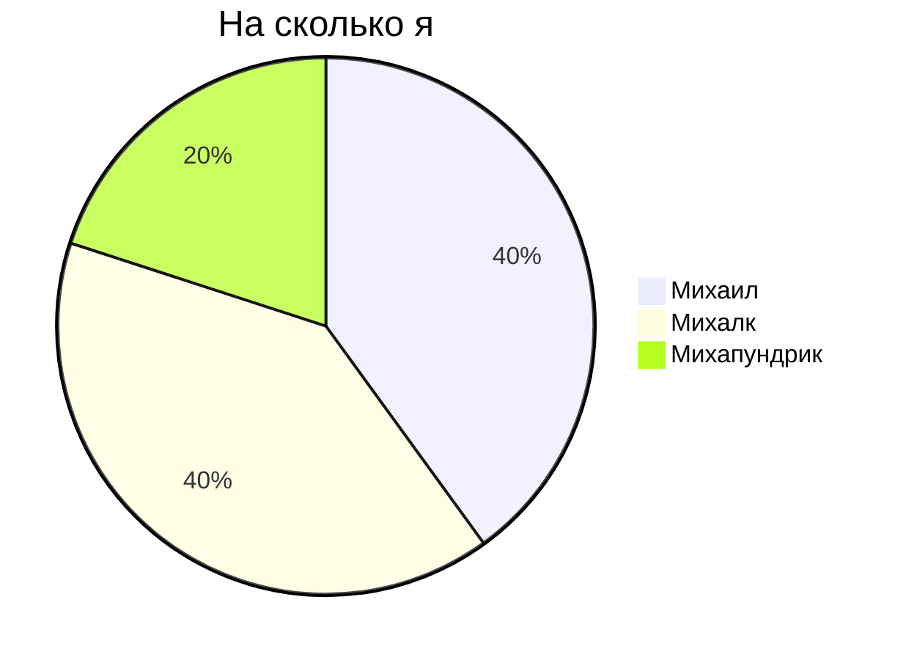
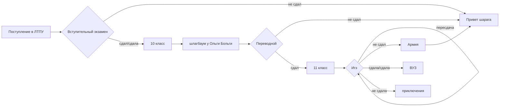
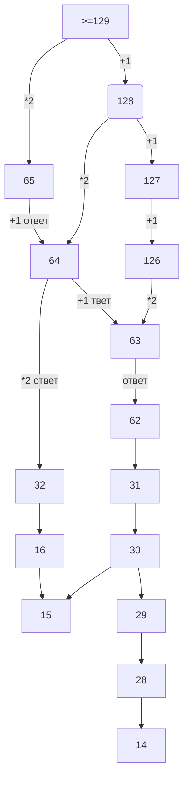

# Михаил Пустовалов 
# 132
Есть:

1)Морзе

2)Перевод СС

3)Таблица СС

4)Икселька Сиссчис(в одном файле таблица, перевод и ряд Фиббоначи)

5)Дилинжеры

6)Икселька с морзянкой

7)Икселька с логикой

8)Логика в питончике

9)A\leftrightarrow B=(\overline{A}\vee B) \text{&} (\overline{B}\vee A)

10)Картинкодел (pictruremaker/panda.py)

11)Викторина.py

12)УРЗ (URZ.py)

13)Комбайн (shtuka.py)

A\leftrightarrow B=(\overline{A}\vee B) \wedge_{}^{}(\overline{B}\vee A)

A\to B=\overline{A}\vee_{}^{}B

$$A\to B=\overline{A}\vee_{}^{}B$$

$$\phi(x)=\frac{1}{\sigma\sqrt{2\pi}}*{e}^{-\frac{(x-\mu)^{2}}{2{\sigma}^{2}}}$$

$${(x+a)}^{n}=\sum^{\substack{n}}_{\substack{k=0}}(\frac{n}{k}){x}^{k}{a}^{n-k}$$

$${\overline E_{1}}^{2}=\sqrt{\frac{F{a}^{x-1}}{(x-1) \cdot x}}+{{\alpha_{1}}^{\frac{1}{3}}}+{{\beta_{1}}^{\frac{2}{3}}}\$$

